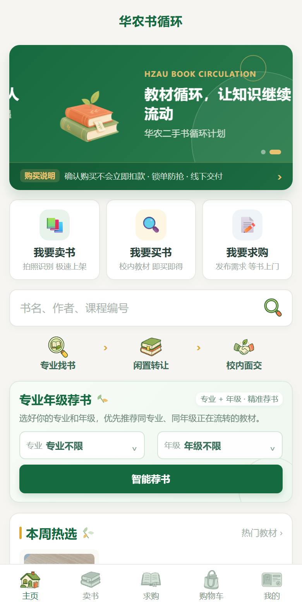
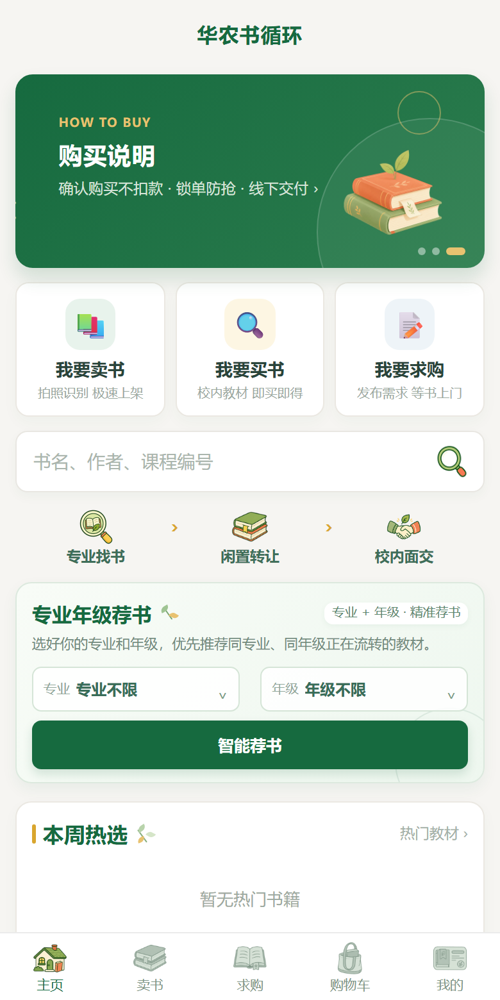
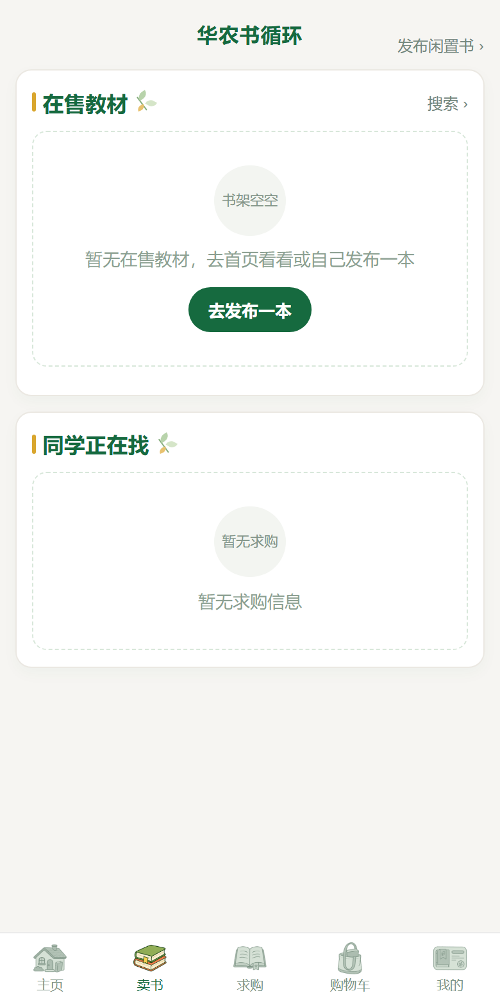
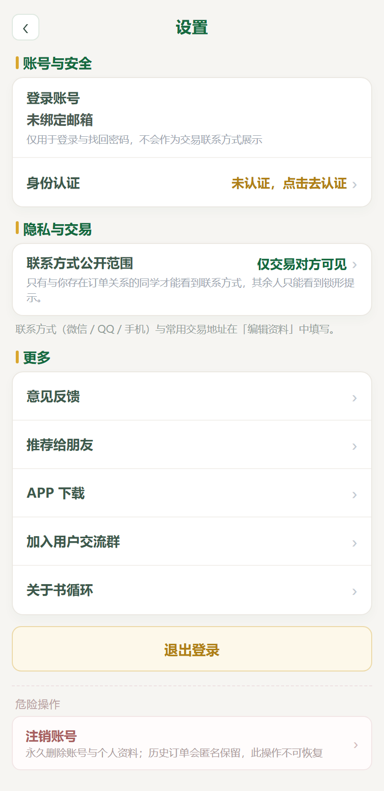

# 华农书循环 · H5

> 校园二手教材流转平台。按**专业 + 年级**找到师兄师姐正在流转的教材，「确认购买」即锁定、线下当面交付，校内自提不走快递。

**在线体验**：https://hzau-bookcycle.app.workbuddy.host/

<p align="center">
  
  
  
  
</p>

---

## 它解决什么问题

华农的教材选择和培养方案强相关：同一门课，不同专业用的版本可能不一样。群里吼一声、翻聊天记录找书，信息很快就沉下去了。

这个平台把「谁在卖、什么专业什么年级用什么书」结构化下来，并且把交易闭环落在**校内当面交付**上 —— 不是假装提供快递物流。

## 核心流程

```
选专业 / 年级
  → 看到同专业同学在流转的教材与求购帖
  → 确认购买（锁定，不扣款）
  → 校内当面交付 · 验书
  → 确认完成
```

## 功能

### 交易

- **「确认购买」= 锁定教材，不扣款**，避免两个人同时抢同一本
- 订单状态：`待面交 → 交易中 → 已完成`，另有取消与**超时自动释放**
- 联系方式**三档可见性**（公开 / 仅交易对方 / 不公开）；不满足条件时**服务端不下发**真实号码，而不是前端 CSS 隐藏
- 购物车、求购帖（「我有此书」一键转发布）、搜索、售出订单
- 首页「购买说明」独立一页，讲清「确认购买不会立即扣款」

### 账号与准入

- 邮箱 + 密码注册；6 位验证码验证邮箱 —— 密码学随机、**库里只存哈希**、5 分钟有效、错 5 次作废、一次性、重发冷却
- **学籍认证**：上传企业微信截图 → 管理员审核；未通过**不能发布、不能购买**
- 登录失败计数与锁定、IP/账号双维度限流、登录审计、多设备会话、改密后全设备下线
- 账号注销（二次确认）：删除账号与资料，**历史订单匿名保留**，不影响交易对方

### 运营后台

- 数据概览；商品审核（拒绝必须填理由，理由对用户可见）
- 用户列表 → 详情下钻 → 处置
- **运营位轮播后台可配**（标题/副标题/图片/跳转/启停/排序，首页前 n 页由它驱动）
- 邮件设置与自检、存储统计、数据备份导出

## 技术栈

| 层 | 选型 |
|---|---|
| 前端 | Vue3 + Vite，22 个页面；沿用小程序的 `<view>/<text>` 标签与 `rpx` 尺寸体系，页面可双向迁移 |
| 后端 | Node + Express，83 个 REST 接口，JSON 落盘，零原生依赖，Windows 可直接跑 |
| 样式 | `--rpx: calc(min(100vw, 480px) / 750)`，PC 端固定 480px 居中列 |
| 部署 | 单进程 HTTP 服务；数据落在部署包之外，启动前自动备份，配部署护栏脚本 |

## 本地运行

```bash
npm install

# 图片资源：应用用的图标与插画在 public/images/，从仓库的 images/ 接入一次即可
node scripts/link-images.mjs

npm run build
npm start            # 默认 http://localhost:8300
```

开发模式（前后端分开）：

```bash
npm run dev            # Vite 前端
npm start              # 后端
```

## 配置（不进版本库）

管理员口令与运营联系方式放在 `server/site-config.json`，**已在 `.gitignore` 中排除**，模板见 `server/site-config.example.json`。也可以用环境变量覆盖：

| 变量 | 说明 |
|---|---|
| `ADMIN_PASSWORD` | 后台管理员口令 |
| `ADMIN_WECHAT` | 展示给用户的运营联系方式 |
| `JWT_SECRET` | 不设则首次启动随机生成并落盘到数据目录 |
| `DATA_DIR` / `PORT` | 数据目录 / 端口 |

## 安全设计

- **源码里没有任何密钥**：JWT 密钥、管理员口令、运营联系方式都不落源码；JWT 密钥首次启动随机生成并持久化，跨重启稳定
- 口令未配置时后台登录接口**直接拒绝** —— 避免"判定是 `输入 !== 配置`、配置为空串导致空口令即登录"这类问题
- 联系方式由服务端控制下发，不是前端隐藏
- 验证码只存哈希；找回密码是匿名接口，**绝不回传验证码**
- 用户数据（订单、联系方式、上传图片）不进版本库

## 与上游的关系

本项目参考开源项目 **[bnbu-second-hand-book-platform](https://github.com/taoyun0303-star/bnbu-second-hand-book-platform)**（作者 Yun Tao）—— 一个微信小程序形态的校园二手教材流转原型，保留了它的产品思路：教材匹配、求购联动、校内面交、确认收书。

本仓库把它重写为可独立部署的 H5 应用（Vue3 前端 + 自建 Node 后端），并按**华中农业大学**的真实场景做了本土化：

- **专业 + 年级荐书**替代课程匹配（53 个专业 × 6 个年级目录，首页/发布/求购三处共用）
- **模拟结算改为锁单面交**（去掉了演示用的下单支付）
- 新增**学籍认证**、**账号体系**、**运营后台**、**联系方式隐私三档**
- 校园场景文案与地址模型（校区 + 宿舍楼，不做快递）
- 数据与部署工程化（数据落包外、自动备份、部署护栏）

逐项改动清单见 [`outputs/开源贡献说明-相对上游的改动.md`](outputs/开源贡献说明-相对上游的改动.md)。

## 已知限制

- 无支付能力，交易为线下当面交付
- 面向校内小规模使用（十余人量级），未做高并发设计
- 图片识别（OCR）依赖外部服务，当前为可选功能
- 尚未提供微信小程序端（H5 的页面结构可按需迁移）

## 许可

本项目为课程 / 作品集项目，非商业用途。上游仓库未附带 LICENSE，如你打算复用本仓库代码，请一并确认上游的授权情况。
